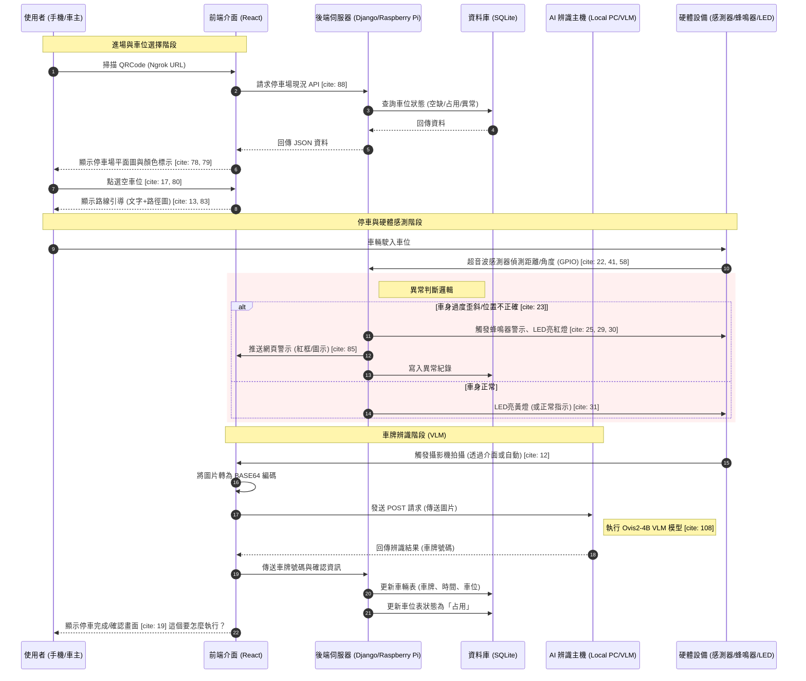
---
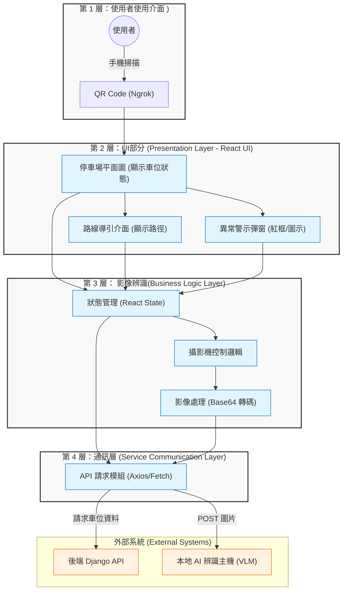
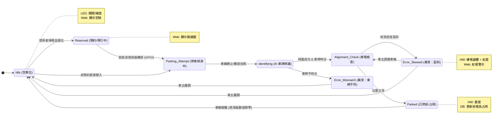
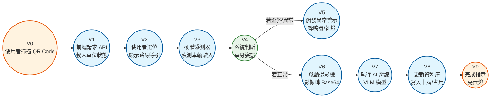
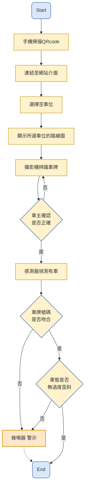

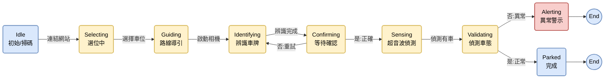

```mermaid
gantt
    title Cordic Pipeline Timing (Critical Path = 13 CLK)
    dateFormat  HH:mm
    axisFormat  %-M
    
    %% 設定 1 CLK = 1 分鐘
    
    section Main Cordic
    Range (Input)       :done,    m_range, 00:00, 1m
    iter 1              :active,  m_it1, after m_range, 2m
    s1 (Red)            :crit,    m_s1, after m_it1, 1m
    iter 2              :active,  m_it2, after m_s1, 2m
    s2 (Red)            :crit,    m_s2, after m_it2, 1m
    iter 3              :active,  m_it3, after m_s2, 2m
    s3 (Red)            :crit,    m_s3, after m_it3, 1m
    iter 4 (Branch Pt)  :active,  m_it4, after m_s3, 2m

    

    section Path Mid (S_exp)
    S_exp (Red)         :crit,    mid_se, after m_it4, 1m
    buffer...     :done,    mid_wait, after mid_se, 4m

    section Path Top (SQ1)
    SQ1_exp (Red)       :crit,    t_sq1e, after m_it4, 1m
    square1 (Blue)      :active,  t_sq1, after t_sq1e, 1m
    buffer...     :done,    t_wait, after t_sq1, 3m

    section Path Bot (SQ2)
    S_q1 (Red)          :crit,    b_sq1, after m_it4, 1m
    square1 (Blue)      :active,  b_sq1b, after b_sq1, 1m
    S_q2 (Red)          :crit,    b_sq2, after b_sq1b, 1m
    square2 (Blue)      :active,  b_sq2b, after b_sq2, 1m
    SQ2_exp (Red)       :crit,    b_exp, after b_sq2b, 1m

    section Result
    Buffer Latch        :done,    buf, after b_exp, 1m



```


```mermaid

gantt
    title Cordic Pipeline Timing (單變數單行顯示)
    dateFormat  HH:mm
    axisFormat  %-M
    
    %% 設定 barHeight 讓圖表不要太過擁擠，保持整潔
    %%{init: { 'gantt': {'barHeight': 25, 'sectionFontSize': 14} } }%%

    %% =======================
    %% Main Cordic Chain
    %% =======================
    section Range (Input)
    Data        :done,   m_range, 00:00, 1m
    
    section iter 1
    Calc        :active, m_it1, after m_range, 2m
    
    section s1 (Red)
    Reg         :crit,   m_s1, after m_it1, 1m
    
    section iter 2
    Calc        :active, m_it2, after m_s1, 2m
    
    section s2 (Red)
    Reg         :crit,   m_s2, after m_it2, 1m
    
    section iter 3
    Calc        :active, m_it3, after m_s2, 2m
    
    section s3 (Red)
    Reg         :crit,   m_s3, after m_it3, 1m
    
    section iter 4
    Branch Pt   :active, m_it4, after m_s3, 2m

    %% =======================
    %% Path Mid (S_exp)
    %% =======================
    section S_exp (Mid)
    Reg         :crit,   mid_se, after m_it4, 1m
    
    section Buffer (Mid)
    Wait        :done,   mid_wait, after mid_se, 4m

    %% =======================
    %% Path Top (SQ1)
    %% =======================
    section SQ1_exp (Top)
    Reg         :crit,   t_sq1e, after m_it4, 1m
    
    section square1 (Top)
    Calc        :active, t_sq1, after t_sq1e, 1m
    
    section Buffer (Top)
    Wait        :done,   t_wait, after t_sq1, 3m

    %% =======================
    %% Path Bot (SQ2)
    %% =======================
    section S_q1 (Bot)
    Reg         :crit,   b_sq1, after m_it4, 1m
    
    section square1 (Bot)
    Calc        :active, b_sq1b, after b_sq1, 1m
    
    section S_q2 (Bot)
    Reg         :crit,   b_sq2, after b_sq1b, 1m
    
    section square2 (Bot)
    Calc        :active, b_sq2b, after b_sq2, 1m
    
    section SQ2_exp (Bot)
    Reg         :crit,   b_exp, after b_sq2b, 1m

    %% =======================
    %% Final Result
    %% =======================
    section Buffer Latch
    Output      :done,   buf, after b_exp, 1m



```


```mermaid
%%{init: { 'gantt': {'tickInterval': '1s', 'axisFormat': '%S'} } }%%
gantt
    title Exp-Adder-Div Pipeline (單位: 秒, 請嘗試拉寬視窗)
    
    %% 改用秒數格式，試圖強制顯示更細的刻度
    dateFormat  s
    axisFormat  %S
    
    %% 設定 1 CLK = 1 秒 (s)
    
    %% --- 情境 A: 運算時間 8 CLK (最快) ---
    section Path Fast (8 CLK)
    Data In             :done,    p8_in, 0, 1s
    Exp (Fast)          :active,  p8_exp, after p8_in, 8s
    Buffer              :done,    p8_buf, after p8_exp, 1s
    Adder (2CLK)        :active,  p8_add, after p8_buf, 2s
    Rap (10CLK)         :crit,    p8_rap, after p8_add, 10s
    Mul (1CLK)          :done,    p8_mul, after p8_rap, 1s

    %% --- 情境 B: 運算時間 9 CLK (中等) ---
    section Path Med (9 CLK)
    Data In             :done,    p9_in, 0, 1s
    Exp (Med)           :active,  p9_exp, after p9_in, 9s
    Buffer              :done,    p9_buf, after p9_exp, 1s
    Adder (2CLK)        :active,  p9_add, after p9_buf, 2s
    Rap (10CLK)         :crit,    p9_rap, after p9_add, 10s
    Mul (1CLK)          :done,    p9_mul, after p9_rap, 1s

    %% --- 情境 C: 運算時間 10 CLK (最慢) ---
    section Path Slow (10 CLK)
    Data In             :done,    p10_in, 0, 1s
    Exp (Slow)          :active,  p10_exp, after p10_in, 10s
    Buffer              :done,    p10_buf, after p10_exp, 1s
    Adder (2CLK)        :active,  p10_add, after p10_buf, 2s
    Rap (10CLK)         :crit,    p10_rap, after p10_add, 10s
    Mul (1CLK)          :done,    p10_mul, after p10_rap, 1s

```

```mermaid

%%{init: { 'gantt': {'tickInterval': '2s', 'axisFormat': '%S'} } }%%
gantt
    title 完整順序: Exp(8->9->10) -> Buffer -> Adder -> Rap -> Mul
    dateFormat  s
    axisFormat  %S
    
    %% 設定 1 CLK = 1 秒
    
    %% ==========================================
    %% 階段 1: Exp 運算 (依序執行)
    %% ==========================================
    section Exp Calculation
    %% 1. 先算 8 CLK 的 4 筆資料
    Batch 1 (Exp 8clk)    :done,    b1, 0, 8s
    
    %% 2. 接著算 9 CLK 的 4 筆資料 (從 8s 開始)
    Batch 2 (Exp 9clk)    :active,  b2, after b1, 9s
    
    %% 3. 接著算 10 CLK 的 4 筆資料 (從 17s 開始)
    Batch 3 (Exp 10clk)   :crit,    b3, after b2, 10s

    %%此時時間來到 T=27 (8+9+10)

    %% ==========================================
    %% 階段 2: 統一存入 Buffer
    %% ==========================================
    section Data Latch
    %% "以上時序完成後" -> 接著存入 Buffer
    %% 所有資料在這裡被鎖存，準備給 Adder 用
    Buffer Latch (All)    :done,    buf, after b3, 1s

    %% ==========================================
    %% 階段 3: 後續處理 (Adder -> Rap -> Mul)
    %% ==========================================
    section Processing
    %% Buffer 之後接著 Adder
    Adder (Sum All)       :active,  add, after buf, 2s
    
    %% Adder 之後接著 Rap
    Rap (Div 10CLK)       :crit,    rap, after add, 10s
    
    %% Rap 之後接著 Mul
    Mul (1CLK)            :done,    mul, after rap, 1s

```

```mermaid

%%{init: { 'gantt': {'tickInterval': '2s', 'axisFormat': '%S'} } }%%
gantt
    title Exp(4平行通道 x 3批次) -> Buffer -> Adder -> Rap -> Mul
    dateFormat  s
    axisFormat  %S
    
    %% 設定 1 CLK = 1 秒
    
    %% ==========================================
    %% 批次 1：8 CLK (4筆平行)
    %% ==========================================
    section Batch 1 (8clk)
    Exp Ch1 (Data 1)      :active, b1_1, 0, 8s
    Exp Ch2 (Data 2)      :active, b1_2, 0, 8s
    Exp Ch3 (Data 3)      :active, b1_3, 0, 8s
    Exp Ch4 (Data 4)      :active, b1_4, 0, 8s

    %% ==========================================
    %% 批次 2：9 CLK (4筆平行)
    %% 接著 Batch 1 之後開始
    %% ==========================================
    section Batch 2 (9clk)
    Exp Ch1 (Data 5)      :active, b2_1, after b1_1, 9s
    Exp Ch2 (Data 6)      :active, b2_2, after b1_2, 9s
    Exp Ch3 (Data 7)      :active, b2_3, after b1_3, 9s
    Exp Ch4 (Data 8)      :active, b2_4, after b1_4, 9s

    %% ==========================================
    %% 批次 3：10 CLK (4筆平行)
    %% 接著 Batch 2 之後開始
    %% ==========================================
    section Batch 3 (10clk)
    Exp Ch1 (Data 9)      :crit,   b3_1, after b2_1, 10s
    Exp Ch2 (Data 10)     :crit,   b3_2, after b2_2, 10s
    Exp Ch3 (Data 11)     :crit,   b3_3, after b2_3, 10s
    Exp Ch4 (Data 12)     :crit,   b3_4, after b2_4, 10s

    %% ==========================================
    %% 後續處理 (不變)
    %% 等 Batch 3 全部結束後才開始
    %% ==========================================
    section Post Process
    Buffer Latch          :done,   buf, after b3_1, 1s
    Adder (Sum All)       :active, add, after buf, 2s
    Rap (10clk)           :crit,   rap, after add, 10s
    Mul (1clk)            :done,   mul, after rap, 1s

```

```mermaid

%%{init: { 'gantt': {'barHeight': 25, 'sectionFontSize': 14} } }%%
gantt
    title Cordic Pipeline (長條圖名稱已更新)
    dateFormat  HH:mm
    axisFormat  %-M
    
    %% =======================
    %% Main Cordic Chain
    %% =======================
    section Range (Input)
    Range       :done,   m_range, 00:00, 1m
    
    section iter 1
    iter 1      :active, m_it1, after m_range, 2m
    
    section iter 2
    iter 2      :active, m_it2, after m_it1, 2m
    
    section iter 3
    iter 3      :active, m_it3, after m_it2, 2m
    
    section iter 4
    iter 4      :active, m_it4, after m_it3, 1m

    %% =======================
    %% Path Mid
    %% =======================
    section Buffer (Mid)
    Buffer      :done,   mid_wait, after m_it4, 2m

    %% =======================
    %% Path Top
    %% =======================
    section square1 (Top)
    square1     :active, t_sq1, after m_it4, 1m
    
    section Buffer (Top)
    Buffer      :done,   t_wait, after t_sq1, 1m

    %% =======================
    %% Path Bot
    %% =======================
    section square1 (Bot)
    square1     :active, b_sq1b, after m_it4, 1m
    
    section square2 (Bot)
    square2     :active, b_sq2b, after b_sq1b, 1m

    %% =======================
    %% Final Result
    %% =======================
    section Buffer Latch
    Buffer Latch :done,   buf, after b_sq2b, 1m

```


```mermaid

%%{init: { 'gantt': {'barHeight': 25, 'sectionFontSize': 14} } }%%
gantt
    title Flowchart to Tspec (Pipeline Timing)
    dateFormat  HH:mm
    axisFormat  %-M
    
    %% =======================
    %% Input
    %% =======================
    section Data (Input)
    data        :done,   d_in, 00:00, 1m

    %% =======================
    %% Stage 1 [First Iteration Block]
    %% =======================
    section It1 (iteration)
    iteration 1 :active, it1, after d_in, 1m

    section S1 (Red)
    s1          :crit,   s1, after it1, 1m

    section It2 (iteration)
    iteration 2 :active, it2, after s1, 1m

    section S2 (Red)
    s2          :crit,   s2, after it2, 1m

    section It3 (iteration)
    iteration 3 :active, it3, after s2, 1m

    %% =======================
    %% Middle Connection
    %% =======================
    section S3 (Red)
    s3          :crit,   s3, after it3, 1m

    %% =======================
    %% Stage 2 [Second Iteration Block]
    %% =======================
    section It4 (iteration)
    iteration 4 :active, it4, after s3, 1m

    section S4 (Red)
    s4          :crit,   s4, after it4, 1m

    section It5 (iteration)
    iteration 5 :active, it5, after s4, 1m

    section S5 (Red)
    s5          :crit,   s5, after it5, 1m

    section It6 (iteration)
    iteration 6 :active, it6, after s5, 1m

    %% =======================
    %% Output
    %% =======================
    section Buffer (Output)
    Buffer      :done,   buf, after it6, 1m

```

```mermaid

%%{init: { 'gantt': {'barHeight': 25, 'sectionFontSize': 14} } }%%
gantt
    title Pipeline Tspec: Normalize (Pre-S3) vs Iteration (Post-S3)
    dateFormat  HH:mm
    axisFormat  %-M
    
    %% 設定 1 CLK = 1 分鐘 (m)

    %% =======================
    %% Input
    %% =======================
    section Input Data
    Data_In         :done,   d_in, 00:00, 1m

    %% =======================
    %% Phase 1: Normalize (S3 之前)
    %% =======================
    
    %% It1 -->|1CLK+1CLK| S1 (Merge -> 2m)
    section Normalize 1 (It1)
    norm_val_1      :active, n1, after d_in, 2m

    %% It2 -->|1CLK+1CLK| S2 (Merge -> 2m)
    section Normalize 2 (It2)
    norm_val_2      :active, n2, after n1, 2m

    %% It3 -->|1CLK| S3 (Merge -> 1m)
    section Normalize 3 (It3)
    norm_val_3      :active, n3, after n2, 1m

    %% =======================
    %% Phase 2: Iteration (S3 之後)
    %% =======================

    %% It4 -->|1CLK+1CLK| S4 (Merge -> 2m)
    section Iteration 1 (It4)
    iter_val_1      :crit,   i1, after n3, 2m

    %% It5 -->|1CLK+1CLK| S5 (Merge -> 2m)
    section Iteration 2 (It5)
    iter_val_2      :crit,   i2, after i1, 2m

    %% It6 -->|1CLK| Buffer (Merge -> 1m)
    section Iteration 3 (It6)
    iter_val_3      :crit,   i3, after i2, 1m

    %% =======================
    %% Output
    %% =======================
    section Buffer Output
    Buf_Out         :done,   buf, after i3, 1m


```

```mermaid
%%{init: { 'gantt': {'tickInterval': '1s', 'axisFormat': '%S'} } }%%
gantt
    title Softmax 3-Stage Pipeline (Exp與Adder重疊執行)
    dateFormat  s
    axisFormat  %S s

    %% ==========================================
    %% Stage 1: Exponential Calculation (Main Engine)
    %% 特點：Exp 單元一直很忙，沒有停下來等 Adder
    %% ==========================================
    section Stage 1: Exp Unit
    Batch 1 (8clk)       :active, e1, 0, 8s
    Batch 2 (9clk)       :active, e2, after e1, 9s
    Batch 3 (10clk)      :active, e3, after e2, 10s

    %% ==========================================
    %% Stage 2: Accumulation Pipeline
    %% 特點：這是流水線的關鍵。
    %% 當 Stage 1 在算 Batch 2 時，Stage 2 正在加總 Batch 1
    %% ==========================================
    section Stage 2: Adder Pipe
    Wait B1             :done,   wait1, 0, 8s
    Buf+Add (Batch 1)   :crit,   acc1, after e1, 3s
    
    %% 空閒時間 (等待 Batch 2 算完)
    Wait B2             :done,   wait2, after acc1, 6s 
    Buf+Add (Batch 2)   :crit,   acc2, after e2, 3s

    %% 等待 Batch 3 算完
    Wait B3             :done,   wait3, after acc2, 7s
    Buf+Add (Batch 3)   :crit,   acc3, after e3, 3s

    %% ==========================================
    %% Stage 3: Final Result (Rap & Mul)
    %% 必須等最後一次加總 (Total Sum) 完成
    %% ==========================================
    section Stage 3: Final Ops
    Rap (Reciprocal)    :active, rap, after acc3, 10s
    Mul (Result)        :done,   mul, after rap, 1s
```

```mermaid
%%{init: { 'gantt': {'barHeight': 20, 'sectionFontSize': 14, 'axisFormat': '%M'} } }%%
gantt
    title Pipeline: Data 1(8clk) -> Data 2(9clk) -> Data 3(10clk)
    dateFormat  HH:mm
    axisFormat  %-M m

    %% ====================================================
    %% Data 1: 標準 8 CLK (參考你的原始代碼)
    %% Main Path: 1(R) + 2(i1) + 2(i2) + 2(i3) + 1(i4) = 8
    %% ====================================================
    section Data 1 (8 CLK)
    Range             :done,    d1_r, 00:00, 1m
    iter 1            :active,  d1_i1, after d1_r, 2m
    iter 2            :active,  d1_i2, after d1_i1, 2m
    iter 3            :active,  d1_i3, after d1_i2, 2m
    iter 4            :active,  d1_i4, after d1_i3, 1m
    Sq1+Sq2 (Bot)     :         d1_bot, after d1_i4, 2m
    Buffer Latch      :         d1_out, after d1_bot, 1m

    %% ====================================================
    %% Data 2: 變為 9 CLK
    %% 流水線入口：延後 2m 進入 (00:02)
    %% 變化：Iter 3 變為 3m (紅色標示)
    %% Main Path: 1 + 2 + 2 + 3 + 1 = 9
    %% ====================================================
    section Data 2 (9 CLK)
    Range             :done,    d2_r, 00:02, 1m
    iter 1            :active,  d2_i1, after d2_r, 2m
    iter 2            :active,  d2_i2, after d2_i1, 2m
    iter 3 (Long)     :crit,    d2_i3, after d2_i2, 3m
    iter 4            :active,  d2_i4, after d2_i3, 1m
    Sq1+Sq2 (Bot)     :         d2_bot, after d2_i4, 2m
    Buffer Latch      :         d2_out, after d2_bot, 1m

    %% ====================================================
    %% Data 3: 變為 10 CLK
    %% 流水線入口：延後 4m 進入 (00:04)
    %% 變化：Iter 3 變為 3m, Iter 4 變為 2m (紅色標示)
    %% Main Path: 1 + 2 + 2 + 3 + 2 = 10
    %% ====================================================
    section Data 3 (10 CLK)
    Range             :done,    d3_r, 00:04, 1m
    iter 1            :active,  d3_i1, after d3_r, 2m
    iter 2            :active,  d3_i2, after d3_i1, 2m
    iter 3 (Long)     :crit,    d3_i3, after d3_i2, 3m
    iter 4 (Long)     :crit,    d3_i4, after d3_i3, 2m
    Sq1+Sq2 (Bot)     :         d3_bot, after d3_i4, 2m
    Buffer Latch      :         d3_out, after d3_bot, 1m

```
```mermaid

%%{init: { 'gantt': {'barHeight': 20, 'sectionFontSize': 14, 'axisFormat': '%M'} } }%%
gantt
    title Pipeline Path Selection: No SQ(8) vs SQ1(9) vs SQ1+2(10)
    dateFormat  HH:mm
    axisFormat  %-M m

    %% ====================================================
    %% Data 1: 總長 8 CLK (最短路徑)
    %% 路徑: Range(1)+i1(2)+i2(2)+i3(2)+i4(1) = 8
    %% 特點: 不經過 Square，直接 Latch
    %% ====================================================
    section Data 1 (8 CLK - No SQ)
    Range             :done,    d1_r, 00:00, 1m
    iter 1            :active,  d1_i1, after d1_r, 2m
    iter 2            :active,  d1_i2, after d1_i1, 2m
    iter 3            :active,  d1_i3, after d1_i2, 2m
    iter 4            :active,  d1_i4, after d1_i3, 1m
    Buffer Latch      :done,    d1_out, after d1_i4, 1m

    %% ====================================================
    %% Data 2: 總長 9 CLK
    %% Start: 延後 2m 進入 (00:02)
    %% 路徑: ... + i4(1) + Square1(1) = 9
    %% 特點: 經過 Square 1
    %% ====================================================
    section Data 2 (9 CLK - SQ1)
    Range             :done,    d2_r, 00:02, 1m
    iter 1            :active,  d2_i1, after d2_r, 2m
    iter 2            :active,  d2_i2, after d2_i1, 2m
    iter 3            :active,  d2_i3, after d2_i2, 2m
    iter 4            :active,  d2_i4, after d2_i3, 1m
    Square 1          :crit,    d2_sq1, after d2_i4, 1m
    Buffer Latch      :done,    d2_out, after d2_sq1, 1m

    %% ====================================================
    %% Data 3: 總長 10 CLK (最長路徑)
    %% Start: 延後 4m 進入 (00:04)
    %% 路徑: ... + i4(1) + Square1(1) + Square2(1) = 10
    %% 特點: 經過 Square 1 和 Square 2
    %% ====================================================
    section Data 3 (10 CLK - SQ1+SQ2)
    Range             :done,    d3_r, 00:04, 1m
    iter 1            :active,  d3_i1, after d3_r, 2m
    iter 2            :active,  d3_i2, after d3_i1, 2m
    iter 3            :active,  d3_i3, after d3_i2, 2m
    iter 4            :active,  d3_i4, after d3_i3, 1m
    Square 1          :crit,    d3_sq1, after d3_i4, 1m
    Square 2          :crit,    d3_sq2, after d3_sq1, 1m
    Buffer Latch      :done,    d3_out, after d3_sq2, 1m

```

```mermaid

%%{init: { 'gantt': {'barHeight': 20, 'sectionFontSize': 14, 'axisFormat': '%M'} } }%%
gantt
    title Tight Pipeline: Data 1(No SQ) / Data 2(SQ1) / Data 3(SQ1+2)
    dateFormat  HH:mm
    axisFormat  %-M m

    %% ====================================================
    %% Data 1: 總長 8 CLK (No Square)
    %% 時間: 00:00 開始
    %% 當它在 00:01 進入 iter 1 時，Data 2 剛好開始 Input
    %% ====================================================
    section Data 1 (8 CLK)
    Range (In)        :done,    d1_r, 00:00, 1m
    iter 1            :active,  d1_i1, after d1_r, 2m
    iter 2            :active,  d1_i2, after d1_i1, 2m
    iter 3            :active,  d1_i3, after d1_i2, 2m
    iter 4            :active,  d1_i4, after d1_i3, 1m
    Buffer Latch      :done,    d1_out, after d1_i4, 1m

    %% ====================================================
    %% Data 2: 總長 9 CLK (With SQ1)
    %% 時間: 00:01 開始 (緊接著 Data 1 的 Input 之後)
    %% ====================================================
    section Data 2 (9 CLK)
    Range (In)        :done,    d2_r, 00:01, 1m
    iter 1            :active,  d2_i1, after d2_r, 2m
    iter 2            :active,  d2_i2, after d2_i1, 2m
    iter 3            :active,  d2_i3, after d2_i2, 2m
    iter 4            :active,  d2_i4, after d2_i3, 1m
    Square 1          :crit,    d2_sq1, after d2_i4, 1m
    Buffer Latch      :done,    d2_out, after d2_sq1, 1m

    %% ====================================================
    %% Data 3: 總長 10 CLK (With SQ1 + SQ2)
    %% 時間: 00:02 開始 (緊接著 Data 2 的 Input 之後)
    %% ====================================================
    section Data 3 (10 CLK)
    Range (In)        :done,    d3_r, 00:02, 1m
    iter 1            :active,  d3_i1, after d3_r, 2m
    iter 2            :active,  d3_i2, after d3_i1, 2m
    iter 3            :active,  d3_i3, after d3_i2, 2m
    iter 4            :active,  d3_i4, after d3_i3, 1m
    Square 1          :crit,    d3_sq1, after d3_i4, 1m
    Square 2          :crit,    d3_sq2, after d3_sq1, 1m
    Buffer Latch      :done,    d3_out, after d3_sq2, 1m

```
```mermaid
graph TD
    %% 定義樣式
    classDef stage1 fill:#e1f5fe,stroke:#01579b,stroke-width:2px,rx:5,ry:5;
    classDef stage2 fill:#fff3e0,stroke:#e65100,stroke-width:2px,rx:5,ry:5;
    classDef pipeReg fill:#cfd8dc,stroke:#455a64,stroke-width:2px,rx:0,ry:0;
    classDef memory fill:#dcedc8,stroke:#33691e,stroke-width:2px,rx:0,ry:0;

    %% 輸入
    Input_Inst[32-bit Instruction] --> Slicer

    subgraph SG1 ["Stage 1: Decode & Fetch (Cycle N)"]
        Slicer[Instruction Slicer] -- "Opcode[6:0]" --> OpCheck{"Opcode Check<br/>== OP_IMM?"}
        Slicer -- "Funct3[14:12]" --> F3Check{"Funct3 Check<br/>(Nested Case)"}
        Slicer -- "Imm[31:20]" --> ImmPath(Immediate Path)

        OpCheck -- Yes --> F3Check
        OpCheck -- No --> SelNone[SEL_NONE]

        F3Check -- "001" --> Sel001[SEL_001]
        F3Check -- "101" --> Sel101[SEL_101]
        F3Check -- Others --> SelNone
    end

    %% 流水線暫存器牆
    subgraph PR ["Pipeline Registers (DFFs)"]
        P1_Imm_Reg["p1_imm_reg<br/>(12-bit Addr)"]
        P1_Sel_Reg["p1_table_sel<br/>(2-bit Control)"]
    end

    %% 連接到暫存器
    ImmPath --> P1_Imm_Reg
    Sel001 --> P1_Sel_Reg
    Sel101 --> P1_Sel_Reg
    SelNone --> P1_Sel_Reg

    subgraph SG2 ["Stage 2: Execute & Memory Access (Cycle N+1)"]
        LUT_001[LUT Mem 001<br/>Funct3=001]:::memory
        LUT_101[LUT Mem 101<br/>Funct3=101]:::memory
        OutputMux{"Output MUX<br/>(Case Statement)"}
        
        P1_Imm_Reg -- Address --> LUT_001
        P1_Imm_Reg -- Address --> LUT_101
        
        LUT_001 -- Data --> OutputMux
        LUT_101 -- Data --> OutputMux
        
        P1_Sel_Reg -- Select Control --> OutputMux
        P1_Sel_Reg -- Valid Generation --> ValidLogic(Valid Logic)
    end

    %% 輸出
    OutputMux --> Output_Data[lut_output]
    ValidLogic --> Output_Valid[valid_out]

    %% 樣式套用
    class SG1 stage1;
    class SG2 stage2;
    class P1_Imm_Reg,P1_Sel_Reg pipeReg;
```


```mermaid
graph TD
    %% 定義樣式
    classDef input fill:#f9f,stroke:#333,stroke-width:2px;
    classDef logic fill:#e1f5fe,stroke:#0277bd,stroke-width:2px;
    classDef field fill:#fff9c4,stroke:#fbc02d,stroke-width:2px;
    classDef hardware fill:#e0f2f1,stroke:#00695c,stroke-width:2px;

    %% 1. 輸入指令
    Instr[32-bit Instruction Machine Code]:::input
    
    %% 2. 第一步：解碼 Opcode
    Instr -->|Bits 6:0| Opcode[Opcode 解碼]:::logic
    
    %% 3. 判斷是否為 I-Type
    Opcode -- 識別為 I-Type --> TypeCheck{I-Type Format}:::logic

    %% 4. 依照 I-Type 格式拆解欄位
    TypeCheck -->|Bits 14:12| Funct3[Funct3 功能碼]:::field
    TypeCheck -->|Bits 31:20| Imm[Immediate 立即數]:::field
    TypeCheck -->|Bits 19:15| RS1[rs1 來源暫存器索引]:::field
    TypeCheck -->|Bits 11:7| RD[rd 目標暫存器索引]:::field

    %% 5. 各欄位的去向 (硬體行為)
    
    %% Funct3 決定具體運算
    Funct3 --> ALU_Ctrl[ALU Control 運算控制]:::hardware
    Opcode -.-> ALU_Ctrl
    
    %% 立即數處理 (重點：你的 LUT 指令在這裡)
    Imm --> SignExt[Sign Extend 符號擴充]:::hardware
    SignExt -->|Operand B| ALU[ALU 運算單元 / LUT 查表]:::hardware
    
    %% rs1 讀取
    RS1 --> RegFile_Read[Register File 讀取埠]:::hardware
    RegFile_Read -->|Operand A| ALU
    
    %% rd 寫回
    RD --> RegFile_Write[Register File 寫入埠]:::hardware
    ALU -->|Result| RegFile_Write

    %% 連結說明
    subgraph Flow [解碼流程]
        direction TB
        Opcode
        TypeCheck
    end

    subgraph Fields [欄位拆解]
        direction LR
        Imm
        RS1
        Funct3
        RD
    end

```

```mermaid
graph TD
    %% 定義樣式以區分層級
    classDef opcode fill:#f9f,stroke:#333,stroke-width:4px,color:black;
    classDef field fill:#dfd,stroke:#333,stroke-width:2px,color:black;
    classDef logic fill:#bdf,stroke:#333,stroke-width:2px,color:black;
    classDef final fill:#ff9,stroke:#333,stroke-width:2px,color:black;

    %% 1. 頂層：Opcode 決定指令格式
    OP("Opcode<br/>(Custom CORDIC)"):::opcode

    %% 2. 第二層：衍生出實體欄位
    OP --> |Bits 19:15| R1(rs1):::field
    OP --> |Bits 24:20| R2(rs2):::field
    OP --> |Bits 31:25 & 14:12| IMM_Raw(imm):::field
    OP --> |Bits 11:7| RD(rd):::final

    %% 3. 第三層：邏輯意義與資料流
    subgraph Data_Logic [資料邏輯處理]
        %% R1 拆解邏輯
        R1 -.-> |讀取暫存器| R1_Data[RS1 Data]
        R1_Data --> |高 16 位| X("x (cordic_x)"):::logic
        R1_Data --> |低 16 位| Y("y (cordic_y)"):::logic

        %% R2 邏輯
        R2 -.-> |讀取暫存器| Z("z (cordic_z / Angle)"):::logic

        %% Imm 邏輯 (查找表索引)
        IMM_Raw --> |拼接 10-bit| IDX("查找表索引值<br/>(Table Index)"):::logic
    end

    %% 4. 運算與寫回 (示意)
    X & Y & Z & IDX -.-o ALU[CORDIC 運算核心]
    ALU --> |計算結果| RD

```


# 📊 AI 模型評估圖表說明 (Model Evaluation)


## 1. 軌跡追蹤圖 (Trajectory Tracking)
這張圖表顯示了 AI 在不同時間點對球落點的預測情況。

### 🟢🔴 線條顏色代表意義
* **<span style="color:blue">灰線 / 實線 (Actual Landing)</span>**：
    * 代表**「標準答案」**。這是球最終實際落在底板上的 X 座標位置。
    * 這是我們希望 AI 能夠逼近的目標。
* **<span style="color:red">紅線 / 虛線 (AI Prediction)</span>**：
    * 代表**「AI 的預測值」**。這是 AI 根據球當前的 X, Y, VX, VY 計算出的落點。
    * 如果紅線緊緊跟隨著藍線波動，代表 AI 能夠精準捕捉球的動向。

### 🧐 如何解讀？
* **重疊度**：兩條線越接近重疊，代表模型越精準。
* **延遲 (Lag)**：如果紅線總是比藍線慢一拍（例如藍線波峰過了，紅線才上去），代表模型反應較慢，可能是訓練資料中的「上拋球」雜訊過多。

---

## 2. 預測準確度與容錯分析 (Accuracy & Tolerance)

### 📏 為什麼「誤差」是被允許的？
在打磚塊遊戲中，我們不需要追求「0 誤差」。

* **板子寬度 (Paddle Width)**：`40 pixels`
* **中心容錯 (Safe Zone)**：只要球落在板子中心左右各 `20 pixels` 的範圍內，都能成功接球。

### ✅ 可接受的誤差範圍：10 ~ 30 pixels
圖表中顯示的 `Abs Err` (絕對誤差) 代表「預測點」與「實際點」的距離：

* **誤差 < 10 pixels**：🎯 **完美預測**。球會打在板子正中心，非常安全。
* **誤差 10 ~ 20 pixels**：✅ **安全範圍**。球會打在板子偏左或偏右的位置，但依然能穩穩接住。
* **誤差 20 ~ 30 pixels**：⚠️ **邊緣救球**。
    * 雖然數學上超過了 20 (半個板子長)，但考慮到遊戲判定與移動慣性，通常在 30 內的誤差，板子邊緣仍有機會「削」到球將其救起。
    * **結論**：只要紅線與藍線的距離保持在這個區間內，AI 在實戰中就是無敵的。

### ❌ 危險訊號
* 如果發現某幾個點的誤差瞬間飆高到 **> 50 pixels**，通常發生在球**剛反彈**或**速度極快**的時候，這時候 AI 可能會發生漏接。


# 📉 損失函數與優化器詳解 (Loss Function & Optimizer)

本專案使用 **MSE** 作為評估標準，並使用 **Adam** 優化器來訓練神經網路。以下是這兩個核心演算法的數學原理與符號詳細說明。

---

## 1. 損失函數：均方誤差 (MSE)

我們使用 MSE 來計算模型預測的落點與真實落點之間的差距。

### 🧮 數學公式
$$MSE = \frac{1}{n} \sum_{i=1}^{n} (y_i - \hat{y}_i)^2$$

### 📝 符號說明 (Symbol Legend)

| 符號 (Symbol) | 意義 (Meaning) | 在本專案中的對應 |
| :--- | :--- | :--- |
| **$MSE$** | **均方誤差** (Mean Squared Error) | 最終算出來的「錯誤分數」，越接近 0 代表模型越準。 |
| **$n$** | **樣本總數** (Batch Size) | 每一批次訓練的資料筆數 (例如 `64` 筆)。 |
| **$\sum$** | **總和符號** (Summation) | 代表把這一批次裡所有資料的誤差加總起來。 |
| **$i$** | **索引** (Index) | 代表第幾筆資料 (從第 1 筆算到第 n 筆)。 |
| **$y_i$** | **真實值** (Ground Truth) | 實際上球最後掉落的 X 座標 (Label)。 |
| **$\hat{y}_i$** | **預測值** (Predicted Value) | AI 模型猜測球會掉在哪個 X 座標。 |
| **$(...)^2$** | **平方** (Square) | 將誤差平方，用來消除負號並**懲罰較大的失誤**。 |

---

## 2. 優化器：Adam (Adaptive Moment Estimation)

Adam 是一種能「自動調整學習速度」並「帶有慣性」的優化算法，它透過計算梯度的一階矩 (Mean) 與二階矩 (Variance) 來更新參數。

### 🧮 數學公式 (核心更新規則)

Adam 的參數更新過程包含以下四個步驟：

1. **計算動量 (Momentum) - 模擬慣性**
   $$m_t = \beta_1 m_{t-1} + (1 - \beta_1) g_t$$

2. **計算能量 (Velocity/Variance) - 調整步伐**
   $$v_t = \beta_2 v_{t-1} + (1 - \beta_2) g_t^2$$

3. **偏差修正 (Bias Correction) - 修正初始誤差**
   $$\hat{m}_t = \frac{m_t}{1 - \beta_1^t}, \quad \hat{v}_t = \frac{v_t}{1 - \beta_2^t}$$

4. **更新參數 (Parameter Update) - 最終修正權重**
   $$\theta_{t+1} = \theta_t - \frac{\eta}{\sqrt{\hat{v}_t} + \epsilon} \hat{m}_t$$

### 📝 符號說明 (Symbol Legend)

| 符號 (Symbol) | 意義 (Meaning) | 在本專案中的對應 |
| :--- | :--- | :--- |
| **$t$** | **時間步** (Time Step) | 目前訓練到第幾次迭代 (Iteration)。 |
| **$\theta_t$** | **當前參數** (Current Weights) | 更新前的模型權重 (例如神經網路的 $w$ 和 $b$)。 |
| **$\theta_{t+1}$** | **新參數** (New Weights) | 更新後的模型權重，將用於下一次預測。 |
| **$g_t$** | **梯度** (Gradient) | 這一輪算出來的斜率，告訴我們「往哪個方向走 Loss 會變小」。 |
| **$m_t$** | **一階矩估計** (First Moment) | 梯度的移動平均 (類似物理的**動量/慣性**)，讓更新方向更穩定。 |
| **$v_t$** | **二階矩估計** (Second Moment) | 梯度平方的移動平均 (類似梯度的**變異數**)，用來判斷路面是否平坦。 |
| **$\hat{m}_t, \hat{v}_t$** | **偏差修正後的值** (Bias-Corrected) | 修正剛開始訓練時 $m$ 和 $v$ 趨近於 0 的誤差。 |
| **$\eta$** | **學習率** (Learning Rate/Eta) | 這是我們設定的參數 (例如 `0.001`)，控制每次跨步的基礎大小。 |
| **$\beta_1$** | **動量衰減率** (Beta 1) | 控制要保留多少歷史動量，通常設為 `0.9`。 |
| **$\beta_2$** | **RMSprop 衰減率** (Beta 2) | 控制要保留多少梯度平方的歷史資訊，通常設為 `0.999`。 |
| **$\epsilon$** | **數值穩定常數** (Epsilon) | 一個極小的值 (例如 $10^{-8}$)，防止分母為 0 導致程式崩潰。 |

---
```mermaid
flowchart TD
    %% --- 初始設定 ---
    Start([開始 SOFTMAX_BLOCK]) --> Init[初始化變數<br/>_sum = 0, _i = 0]

    %% --- 階段 1: Exp 計算與累加 ---
    subgraph Phase1 ["階段 1: 計算 Exp 並累加 (Accumulate)"]
        direction TB
        CheckLoop1{_i < count ?}
        
        LoadVal[讀取輸入值<br/>_val_in = in_arr_i]
        
        %% 關鍵硬體指令
        AsmExp[[ASM_CORDIC_EXP<br/>呼叫硬體計算 e^x]]
        
        StoreTemp[暫存 Exp 結果<br/>out_arr_i = _exp_res]
        
        %% 關鍵硬體指令
        AsmAdd[[ASM_ADD<br/>累加總和 _sum += _exp_res]]
        
        IncLoop1[計數器 _i++]

        Init --> CheckLoop1
        CheckLoop1 -- Yes --> LoadVal
        LoadVal --> AsmExp
        AsmExp --> StoreTemp
        StoreTemp --> AsmAdd
        AsmAdd --> IncLoop1
        IncLoop1 --> CheckLoop1
    end

    %% --- 中間輸出 ---
    ExportSum[匯出總和<br/>*sum_out_ptr = _sum]
    CheckLoop1 -- No --> ExportSum

    %% --- 階段 2: 正規化 ---
    subgraph Phase2 ["階段 2: 正規化 (Normalization)"]
        direction TB
        ResetLoop[重置計數器 _i = 0]
        CheckLoop2{_i < count ?}
        
        LoadExp[讀取暫存的 Exp 值<br/>_curr_exp = out_arr_i]
        
        BitShift[定點數擴展<br/>_numerator = _curr_exp << 16]
        
        %% 關鍵硬體指令
        AsmDiv[[ASM_DIV<br/>EXP / EXP_sum]]
        
        StoreProb[儲存最終機率<br/>out_arr_i = _final_prob]
        
        IncLoop2[計數器 _i++]

        ExportSum --> ResetLoop
        ResetLoop --> CheckLoop2
        CheckLoop2 -- Yes --> LoadExp
        LoadExp --> BitShift
        BitShift --> AsmDiv
        AsmDiv --> StoreProb
        StoreProb --> IncLoop2
        IncLoop2 --> CheckLoop2
    end

    %% --- 結束 ---
    End([結束 End])
    CheckLoop2 -- No --> End

    %% --- 樣式設定 ---
    style AsmExp fill:#d1c4e9,stroke:#512da8,stroke-width:2px,color:black
    style AsmAdd fill:#ffe0b2,stroke:#f57c00,stroke-width:2px,color:black
    style AsmDiv fill:#ffe0b2,stroke:#f57c00,stroke-width:2px,color:black
    style StoreTemp fill:#e3f2fd,stroke:#1565c0
    style BitShift fill:#e3f2fd,stroke:#1565c0
```

```mermaid
graph TD
    subgraph "Compute Subsystem"
        C0("MIV_RV32 Core 0<br/>(Master 0)")
        C1("MIV_RV32 Core 1<br/>(Master 1)")
    end

    subgraph "Interconnect"
        Matrix{"AHB Bus Matrix<br/>(CoreAHB)"}
    end

    subgraph "Memory & Peripherals"
        PM0[("Private RAM<br/>(Core 0 Code/Stack)")]
        PM1[("Private RAM<br/>(Core 1 Code/Stack)")]
        SM[("Shared SRAM<br/>(Data Exchange)")]
        PER["Peripherals<br/>(UART, GPIO, SPI)"]
    end

    %% AHB Bus Connections
    C0 -- "AHBL_M_TARGET" --> Matrix
    C1 -- "AHBL_M_TARGET" --> Matrix
    
    Matrix -- "Port 0" --> PM0
    Matrix -- "Port 1" --> PM1
    Matrix -- "Port 2" --> SM
    Matrix -- "Port 3" --> PER

    %% IPC Connections
    C0 -. "GPIO Out -> EXT_IRQ" .-> C1
    C1 -. "GPIO Out -> EXT_IRQ" .-> C0

    %% Styling
    style C0 fill:#d4e1f5,stroke:#333,stroke-width:2px
    style C1 fill:#d4e1f5,stroke:#333,stroke-width:2px
    style Matrix fill:#f9f2d0,stroke:#d4a017,stroke-width:2px
    style SM fill:#ffdddd,stroke:#333


```
```mermaid
graph TD
    subgraph "Compute Cluster"
        C0[("Core 0")]
        C1[("Core 1")]
        C2[("Core 2")]
        C3[("Core 3")]
    end

    subgraph "Interconnect"
        Matrix{{"AHB Bus Matrix (4 Masters)"}}
    end

    subgraph "Memory System"
        L0[("Local RAM 0")]
        L1[("Local RAM 1")]
        L2[("Local RAM 2")]
        L3[("Local RAM 3")]
        Shared[("Shared SRAM")]
    end
    
    subgraph "Control"
        IPC["IPC / IRQ Controller<br/>(Custom Logic)"]
    end

    %% Master Connections
    C0 --> Matrix
    C1 --> Matrix
    C2 --> Matrix
    C3 --> Matrix

    %% Slave Connections (Simplified)
    Matrix --> L0
    Matrix --> L1
    Matrix --> L2
    Matrix --> L3
    Matrix --> Shared
    Matrix --> IPC

    %% Interrupt Feedback
    IPC -.->|IRQ| C0
    IPC -.->|IRQ| C1
    IPC -.->|IRQ| C2
    IPC -.->|IRQ| C3

    style Matrix fill:#f9f2d0,stroke:#d4a017
    style IPC fill:#ffcccc,stroke:#333
    style Shared fill:#e1d5e7,stroke:#333
```

```mermaid
gantt
    title 嵌入式 AI 加速實作與論文撰寫計畫 (1月 - 6月)
    dateFormat  YYYY-MM-DD
    axisFormat  %m月

    section 前置與模擬 (1/21前-2/21)
    前置文獻與工具準備       :2024-01-01, 2024-01-20
    Spike QEMU 環境搭建      :2024-01-21, 12d
    QEMU 功能驗證與模擬      :crit, 2024-02-05, 2024-02-21

    section 實體板實作 (2/21-3/21)
    ResNet 50 模型移植       :2024-02-21, 10d
    軟體 Softmax 基準測試    :2024-03-05, 5d
    硬體 Softmax 加速實作    :2024-03-10, 7d
    SW HW 數據比較與採集     :crit, 2024-03-17, 2024-03-21

    section 論文數據與架構 (3/22-4/30)
    實驗數據整理與圖表繪製   :p1, 2024-03-22, 10d
    撰寫系統架構 Method      :p2, after p1, 14d
    撰寫實驗結果分析 Result  :p3, after p2, 14d

    section 論文完稿與修訂 (5月-6月)
    撰寫緒論與相關研究       :2024-05-05, 14d
    論文初稿完成             :milestone, 2024-05-23, 0d
    指導教授審閱與修改       :2024-05-24, 20d
    格式調整與最終定稿       :crit, 2024-06-17, 10d
    論文繳交與口試準備       :milestone, 2024-06-30,
 0d
```
```mermaid
graph LR
    %% 定義節點 (Vertices represent Activities)
    Input((V0: Input Feature))
    
    %% 主線路徑 (Main Branch)
    MainConv((V1: Main Conv2d))
    
    %% 支線路徑 (Acceleration Branch - 你的 AOV 模組)
    WeightFetch((V2: Fetch Weights))
    WeightConv((V3: Weight Conv1d))
    Softmax((V4: Softmax))
    
    %% 匯合點 (Integration)
    Gating((V5: Gating / Mul))
    NextLayer((V6: Next Layer))

    %% 定義邊 (Edges represent Dependency)
    Input --> MainConv
    Input --> WeightFetch
    
    %% 支線流程
    WeightFetch --> WeightConv
    WeightConv --> Softmax
    
    %% 關鍵匯合：主線算出特徵，支線算出機率，兩者相乘
    MainConv --> Gating
    Softmax --> Gating
    
    Gating --> NextLayer

```

```mermaid
graph TD
    %% --- 定義樣式 ---
    classDef memory fill:#e1f5fe,stroke:#01579b,stroke-width:2px;
    classDef sw_control fill:#fff3e0,stroke:#e65100,stroke-width:2px;
    classDef hw_conv fill:#f3e5f5,stroke:#4a148c,stroke-width:2px;
    classDef hw_softmax fill:#e8f5e9,stroke:#1b5e20,stroke-width:2px;
    classDef integration fill:#fff9c4,stroke:#fbc02d,stroke-width:2px;

    %% --- V0: 輸入 ---
    V0((V0: Input Feature)):::memory
    
    %% --- 分流 (ResNet 核心結構) ---
    V0 --> Split_Point{Split Data}
    
    %% --- 路徑 A: 捷徑 (Skip Connection / Identity) ---
    subgraph Skip_Path ["捷徑路徑 (Software/Direct)"]
        Split_Point -- 原始數據副本 --> V1_Delay[V1: Delay FIFO<br>等待卷積完成]:::sw_control
    end

    %% --- 路徑 B: 瓶頸層計算 (Hardware Accelerated) ---
    subgraph Bottleneck_Path ["瓶頸層計算 (HW加速)"]
        direction TB
        
        %% 步驟 1: 權重與數據準備
        Split_Point -- 進入計算流 --> V2_Fetch[V2: Fetch Weights<br>載入 1x1/3x3 權重]:::hw_conv
        
        %% 步驟 2: 卷積硬體核心 (您指定的乘加樹)
        subgraph Conv_Hardware ["V3: Convolution Engine (乘加樹)"]
            V2_Fetch --> V3_Mult[<b>乘法樹</b><br>Multiplier Tree<br>並行計算 Ch x Kernel]:::hw_conv
            V3_Mult --> V3_Add[<b>加法樹</b><br>Adder Tree<br>快速收斂]:::hw_conv
            V3_Add --> V3_Acc[累加器<br>Accumulator<br>完成 1x1->3x3->1x1]:::hw_conv
        end
    end

    %% --- V4: 殘差匯合 (Residual Add) ---
    V4_Node((V4: Residual Add<br>元素相加)):::integration
    
    V1_Delay --> V4_Node
    V3_Acc --> V4_Node
    
    %% --- V5: 激勵函數 (Softmax 加速) ---
    %% 這裡接上您指定的 Softmax 硬體流水線
    subgraph Softmax_Hardware ["V5: Activation/Output (Softmax HW)"]
        V4_Node --> V5_Max[Find Max<br>比較器樹]:::hw_softmax
        V5_Max --> V5_Sub[Sub Max]:::hw_softmax
        V5_Sub --> V5_Exp[Exp LUT<br>指數查表]:::hw_softmax
        V5_Exp --> V5_Sum[Sum Tree<br>分母累加]:::hw_softmax
        V5_Sum --> V5_Div[Div Unit<br>倒數乘法/除法]:::hw_softmax
    end

    %% --- V6: 輸出 ---
    V6((V6: Next Layer)):::memory
    V5_Div --> V6
```
