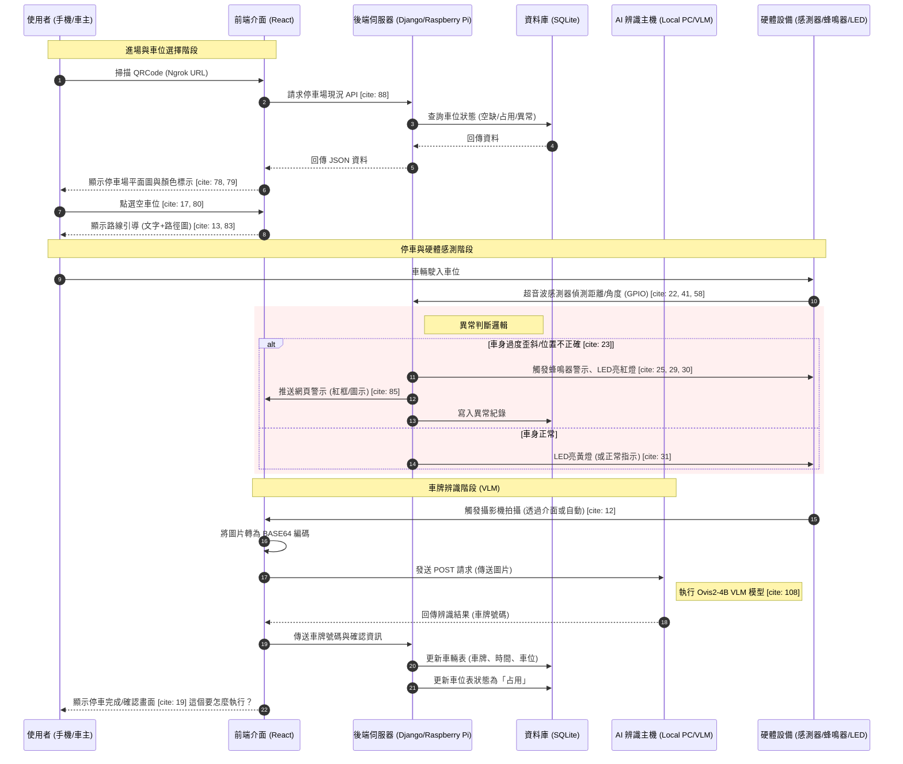
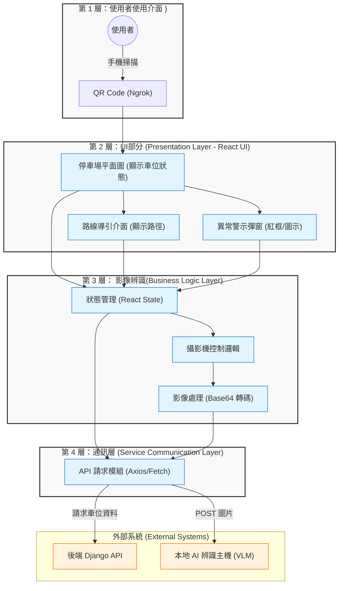
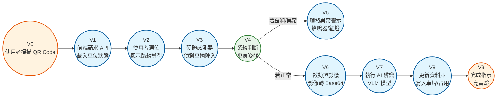
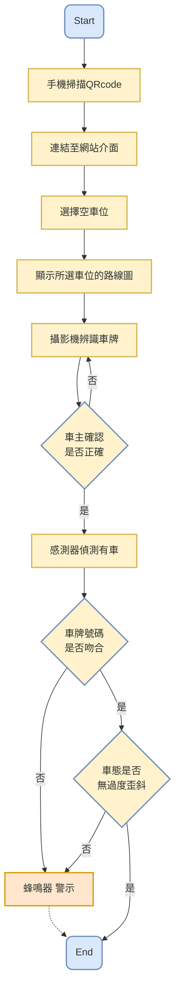
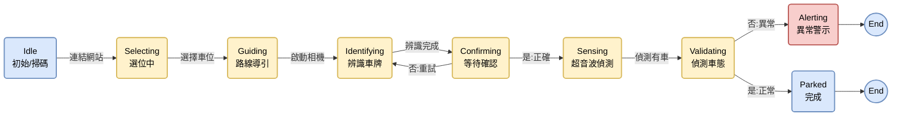

```mermaid

sequenceDiagram
    autonumber
    participant User as 使用者 (手機/車主)
    participant FE as 前端介面 (React)
    participant BE as 後端伺服器 (Django/Raspberry Pi)
    participant DB as 資料庫 (SQLite)
    participant AI as AI 辨識主機 (Local PC/VLM)
    participant HW as 硬體設備 (感測器/蜂鳴器/LED)

    Note over User, FE: 進場與車位選擇階段
    User->>FE: 掃描 QRCode (Ngrok URL) 
    FE->>BE: 請求停車場現況 API [cite: 88]
    BE->>DB: 查詢車位狀態 (空缺/占用/異常) 
    DB-->>BE: 回傳資料
    BE-->>FE: 回傳 JSON 資料
    FE-->>User: 顯示停車場平面圖與顏色標示 [cite: 78, 79]
    User->>FE: 點選空車位 [cite: 17, 80]
    FE-->>User: 顯示路線引導 (文字+路徑圖) [cite: 13, 83]

    Note over User, HW: 停車與硬體感測階段
    User->>HW: 車輛駛入車位
    HW->>BE: 超音波感測器偵測距離/角度 (GPIO) [cite: 22, 41, 58]
    
    rect rgb(255, 240, 240)
    Note right of BE: 異常判斷邏輯
    alt 車身過度歪斜/位置不正確 [cite: 23]
        BE->>HW: 觸發蜂鳴器警示、LED亮紅燈 [cite: 25, 29, 30]
        BE->>FE: 推送網頁警示 (紅框/圖示) [cite: 85]
        BE->>DB: 寫入異常紀錄 
    else 車身正常
        BE->>HW: LED亮黃燈 (或正常指示) [cite: 31]
    end
    end

    Note over FE, AI: 車牌辨識階段 (VLM)
    HW->>FE: 觸發攝影機拍攝 (透過介面或自動) [cite: 12]
    FE->>FE: 將圖片轉為 BASE64 編碼 
    FE->>AI: 發送 POST 請求 (傳送圖片) 
    Note right of AI: 執行 Ovis2-4B VLM 模型 [cite: 108]
    AI-->>FE: 回傳辨識結果 (車牌號碼)
    FE->>BE: 傳送車牌號碼與確認資訊
    BE->>DB: 更新車輛表 (車牌、時間、車位) 
    BE->>DB: 更新車位表狀態為「占用」 
    FE-->>User: 顯示停車完成/確認畫面 [cite: 19] 這個要怎麼執行？

```
---

```mermaid
graph TD
    %% 定義樣式
    classDef layer fill:#f9f9f9,stroke:#333,stroke-width:2px;
    classDef component fill:#e1f5fe,stroke:#0277bd,stroke-width:1px;
    classDef external fill:#fff3e0,stroke:#ef6c00,stroke-width:1px;

    subgraph User_Layer ["第 1 層：使用者使用介面 )"]
        direction TB
        U((使用者)) -->|手機掃描| QR["QR Code (Ngrok)"]
    end

    subgraph Presentation_Layer ["第 2 層：UI部分 (Presentation Layer - React UI)"]
        direction TB
        Page_Map["停車場平面圖 (顯示車位狀態)"]
        Page_Guide["路線導引介面 (顯示路徑)"]
        Alert_UI["異常警示彈窗 (紅框/圖示)"]
    end

    subgraph Logic_Layer ["第 3 層： 影像辨識(Business Logic Layer)"]
        direction TB
        State_Mgr["狀態管理 (React State)"]
        Img_Process["影像處理 (Base64 轉碼)"]
        Cam_Ctrl["攝影機控制邏輯"]
    end

    subgraph Service_Layer ["第 4 層：通訊層 (Service Communication Layer)"]
        direction TB
        API_Client["API 請求模組 (Axios/Fetch)"]
    end

    subgraph External_Systems ["外部系統 (External Systems)"]
        Backend_API["後端 Django API"]
        AI_Server["本地 AI 辨識主機 (VLM)"]
    end

    %% 層級關聯
    QR --> Page_Map
    Page_Map --> Page_Guide
    Page_Map --> Alert_UI

    Page_Map --> State_Mgr
    Page_Guide --> State_Mgr
    Alert_UI --> State_Mgr
    
    State_Mgr --> Cam_Ctrl
    Cam_Ctrl --> Img_Process
    
    State_Mgr --> API_Client
    Img_Process --> API_Client

    API_Client -->|"請求車位資料"| Backend_API
    API_Client -->|"POST 圖片"| AI_Server

    %% 套用樣式
    class User_Layer,Presentation_Layer,Logic_Layer,Service_Layer layer;
    class Page_Map,Page_Guide,Alert_UI,State_Mgr,Img_Process,Cam_Ctrl,API_Client component;
    class Backend_API,AI_Server external;
```

```mermaid
stateDiagram-v2
    direction LR

    %% 定義狀態
    state "Idle (空車位)" as Idle
    state "Reserved (預約/導引中)" as Reserved
    state "Parking_Attempt (停車偵測中)" as Parking
    state "Identifying (AI 車牌辨識)" as AI_Check
    state "Alignment_Check (車態檢查)" as Align
    state "Parked (已停妥/占用)" as Occupied
    
    %% 異常狀態
    state "Error_Skewed (異常：歪斜)" as Err_Skew
    state "Error_Mismatch (異常：車牌不符)" as Err_Plate

    %% 初始狀態
    [*] --> Idle

    %% 狀態流轉
    Idle --> Reserved : 使用者掃碼並選位
    
    Reserved --> Parking : 超音波感測器觸發 (GPIO)
    Idle --> Parking : 未預約直接駛入
    
    Parking --> AI_Check : 車輛靜止/觸發拍照
    
    AI_Check --> Align : 辨識成功 & 車牌吻合
    AI_Check --> Err_Plate : 車牌不吻合
    
    Align --> Err_Skew : 偵測過度歪斜
    Align --> Occupied : 位置正常

    %% 錯誤處理與恢復
    Err_Skew --> Align : 車主調整車輛
    Err_Skew --> Idle : 車主離開
    Err_Plate --> Idle : 車主離開

    %% 離場
    Occupied --> Idle : 車輛駛離 (感測器數值歸零)

    %% 狀態行為註解 (Actions)
    note right of Idle
        LED: 關閉/綠燈
        Web: 顯示空缺
    end note

    note right of Reserved
        Web: 顯示路線圖
    end note

    note right of Err_Skew
        HW: 蜂鳴器響 + 紅燈
        Web: 紅框警示
    end note

    note right of Occupied
        HW: 黃燈
        DB: 更新狀態為占用
    end note
```

```mermaid
graph LR
    %% 定義節點樣式 (圓形代表頂點 Vertex)
    classDef process fill:#e1f5fe,stroke:#01579b,stroke-width:2px,rx:50,ry:50;
    classDef startend fill:#fff3e0,stroke:#e65100,stroke-width:2px,rx:50,ry:50;
    classDef decision fill:#e8f5e9,stroke:#2e7d32,stroke-width:2px,rx:50,ry:50;

    %% 定義頂點 (Vertices) - 代表活動
    V0((V0<br>使用者掃描 QR Code))
    V1((V1<br>前端請求 API<br>載入車位狀態))
    V2((V2<br>使用者選位<br>顯示路線導引))
    V3((V3<br>硬體感測器<br>偵測車輛駛入))
    V4((V4<br>系統判斷<br>車身姿態))
    
    %% 分支活動
    V5((V5<br>觸發異常警示<br>蜂鳴器/紅燈))
    V6((V6<br>啟動攝影機<br>影像轉 Base64))
    V7((V7<br>執行 AI 辨識<br>VLM 模型))
    V8((V8<br>更新資料庫<br>寫入車牌/占用))
    V9((V9<br>完成指示<br>亮黃燈))

    %% 定義邊 (Edges) - 代表先後依賴關係
    V0 --> V1
    V1 --> V2
    V2 --> V3
    V3 --> V4
    
    %% 異常依賴鏈
    V4 -->|"若歪斜/異常"| V5
    
    %% 正常依賴鏈
    V4 -->|"若正常"| V6
    V6 --> V7
    V7 --> V8
    V8 --> V9

    %% 樣式套用
    class V0,V9 startend;
    class V1,V2,V3,V5,V6,V7,V8 process;
    class V4 decision;
```

```mermaid

graph TD
    %% 定義節點樣式
    classDef process fill:#fff2cc,stroke:#d6b656,stroke-width:2px;
    classDef decision fill:#fff2cc,stroke:#6c8ebf,stroke-width:2px,shape:rhombus;
    classDef terminal fill:#dae8fc,stroke:#6c8ebf,stroke-width:2px,rx:10,ry:10;
    classDef alert fill:#ffe6cc,stroke:#d79b00,stroke-width:2px;

    %% 節點定義 (完全依照圖片文字)
    Start("Start"):::terminal
    Step1["手機掃描QRcode"]:::process
    Step2["連結至網站介面"]:::process
    Step3["選擇空車位"]:::process
    Step4["顯示所選車位的路線圖"]:::process
    Step5["攝影機辨識車牌"]:::process
    
    Check1{"車主確認<br>是否正確"}:::decision
    
    Step6["感測器偵測有車"]:::process
    
    Check2{"車牌號碼<br>是否吻合"}:::decision
    
    Check3{"車態是否<br>無過度歪斜"}:::decision
    
    Alert["蜂鳴器 警示"]:::alert
    End("End"):::terminal

    %% 連線定義 (依照箭頭流向)
    Start --> Step1
    Step1 --> Step2
    Step2 --> Step3
    Step3 --> Step4
    Step4 --> Step5
    Step5 --> Check1
    
    %% 判斷 1: 車主確認
    Check1 -- "否" --> Step5
    Check1 -- "是" --> Step6
    
    %% 流程接續
    Step6 --> Check2
    
    %% 判斷 2: 車牌吻合
    Check2 -- "否" --> Alert
    Check2 -- "是" --> Check3
    
    %% 判斷 3: 車態歪斜
    Check3 -- "否" --> Alert
    Check3 -- "是" --> End
    
    %% 修正蜂鳴器後的流向 (圖中蜂鳴器下方有箭頭，通常指向結束或迴圈，此處依圖示結構暫指結束方向)
    Alert -.-> End
```

```mermaid

graph LR
    %% 樣式設定
    classDef std fill:#fff2cc,stroke:#d6b656,stroke-width:2px,color:black;
    classDef terminal fill:#dae8fc,stroke:#6c8ebf,stroke-width:2px,color:black;
    classDef warn fill:#f8cecc,stroke:#b85450,stroke-width:2px,color:black;

    %% 節點定義 (使用圓角括號)
    S1(Idle<br>初始/掃碼):::terminal
    S2(Selecting<br>選位中):::std
    S3(Guiding<br>路線導引):::std
    S4(Identifying<br>辨識車牌):::std
    S5(Confirming<br>等待確認):::std
    S6(Sensing<br>超音波偵測):::std
    S7(Validating<br>偵測車態):::std
    S8(Alerting<br>異常警示):::warn
    S9(Parked<br>完成):::terminal

    %% 連線與標籤
    S1 -->|連結網站| S2
    S2 -->|選擇車位| S3
    S3 -->|啟動相機| S4
    S4 -->|辨識完成| S5
    
    S5 -->|否:重試| S4
    S5 -->|是:正確| S6
    
    S6 -->|偵測有車| S7
    
    S7 -->|否:異常| S8
    S7 -->|是:正常| S9

    %% 結束點
    S8 --> End1((End)):::terminal
    S9 --> End2((End)):::terminal
```

```mermaid
gantt
    title Cordic Pipeline Timing (Critical Path = 13 CLK)
    dateFormat  HH:mm
    axisFormat  %-M
    
    %% 設定 1 CLK = 1 分鐘
    
    section Main Cordic
    Range (Input)       :done,    m_range, 00:00, 1m
    iter 1              :active,  m_it1, after m_range, 2m
    s1 (Red)            :crit,    m_s1, after m_it1, 1m
    iter 2              :active,  m_it2, after m_s1, 2m
    s2 (Red)            :crit,    m_s2, after m_it2, 1m
    iter 3              :active,  m_it3, after m_s2, 2m
    s3 (Red)            :crit,    m_s3, after m_it3, 1m
    iter 4 (Branch Pt)  :active,  m_it4, after m_s3, 2m

    

    section Path Mid (S_exp)
    S_exp (Red)         :crit,    mid_se, after m_it4, 1m
    buffer...     :done,    mid_wait, after mid_se, 4m

    section Path Top (SQ1)
    SQ1_exp (Red)       :crit,    t_sq1e, after m_it4, 1m
    square1 (Blue)      :active,  t_sq1, after t_sq1e, 1m
    buffer...     :done,    t_wait, after t_sq1, 3m

    section Path Bot (SQ2)
    S_q1 (Red)          :crit,    b_sq1, after m_it4, 1m
    square1 (Blue)      :active,  b_sq1b, after b_sq1, 1m
    S_q2 (Red)          :crit,    b_sq2, after b_sq1b, 1m
    square2 (Blue)      :active,  b_sq2b, after b_sq2, 1m
    SQ2_exp (Red)       :crit,    b_exp, after b_sq2b, 1m

    section Result
    Buffer Latch        :done,    buf, after b_exp, 1m


```

```mermaid

gantt
    title Pipeline Timing (刻度 = 分鐘數, 10ns = 1CLK)
    
    %% 1. 設定時間格式為「小時:分鐘」
    dateFormat  HH:mm
    
    %% 2. 設定軸線只顯示「分鐘數 (不補0)」
    %% 如果你的編輯器不支援 %-M，請改回 %M (會顯示 00, 01, 02...)
    axisFormat  %-M
    
    %% 3. 強制 X 軸從 00:00 開始
    %% 所有的長度單位都改用 "m" (分鐘)
    
    section Data 1
    Input (1CLK)      :done,    d1_in, 00:00, 1m
    ite1 (2CLK)         :active,  d1_s1, after d1_in, 2m
    ite2 (2CLK)         :active,  d1_s2, after d1_s1, 2m
    ite3 (1CLK)         :         d1_s3, after d1_s2, 1m
    ite4 (2CLK)         :crit,    d1_s4, after d1_s3, 2m
    ite5 (2CLK)         :crit,    d1_s5, after d1_s4, 2m
    Buffer (1CLK)     :done,    d1_buf, after d1_s5, 1m

    section Data 2
    %% II=2，所以從 00:02 開始
    Input (1CLK)      :done,    d2_in, 00:01, 1m
    ite1 (2CLK)         :active,  d2_s1, after d2_in, 2m
    ite2 (2CLK)         :active,  d2_s2, after d2_s1, 2m
    ite3 (1CLK)         :         d2_s3, after d2_s2, 1m
    ite4 (2CLK)         :crit,    d2_s4, after d2_s3, 2m
    ite5 (2CLK)         :crit,    d2_s5, after d2_s4, 2m
    Buffer (1CLK)     :done,    d2_buf, after d2_s5, 1m

    section Data 3
    %% II=2，所以從 00:04 開始
    Input (1CLK)      :done,    d3_in, 00:02, 1m
    ite1 (2CLK)         :active,  d3_s1, after d3_in, 2m
    ite2 (2CLK)         :active,  d3_s2, after d3_s1, 2m
    ite3 (1CLK)         :         d3_s3, after d3_s2, 1m
    ite4 (2CLK)         :crit,    d3_s4, after d3_s3, 2m
    ite5 (2CLK)         :crit,    d3_s5, after d3_s4, 2m
    Buffer (1CLK)     :done,    d3_buf, after d3_s5, 1m

```

```mermaid
%%{init: { 'gantt': {'tickInterval': '1s', 'axisFormat': '%S'} } }%%
gantt
    title Exp-Adder-Div Pipeline (單位: 秒, 請嘗試拉寬視窗)
    
    %% 改用秒數格式，試圖強制顯示更細的刻度
    dateFormat  s
    axisFormat  %S
    
    %% 設定 1 CLK = 1 秒 (s)
    
    %% --- 情境 A: 運算時間 8 CLK (最快) ---
    section Path Fast (8 CLK)
    Data In             :done,    p8_in, 0, 1s
    Exp (Fast)          :active,  p8_exp, after p8_in, 8s
    Buffer              :done,    p8_buf, after p8_exp, 1s
    Adder (2CLK)        :active,  p8_add, after p8_buf, 2s
    Rap (10CLK)         :crit,    p8_rap, after p8_add, 10s
    Mul (1CLK)          :done,    p8_mul, after p8_rap, 1s

    %% --- 情境 B: 運算時間 9 CLK (中等) ---
    section Path Med (9 CLK)
    Data In             :done,    p9_in, 0, 1s
    Exp (Med)           :active,  p9_exp, after p9_in, 9s
    Buffer              :done,    p9_buf, after p9_exp, 1s
    Adder (2CLK)        :active,  p9_add, after p9_buf, 2s
    Rap (10CLK)         :crit,    p9_rap, after p9_add, 10s
    Mul (1CLK)          :done,    p9_mul, after p9_rap, 1s

    %% --- 情境 C: 運算時間 10 CLK (最慢) ---
    section Path Slow (10 CLK)
    Data In             :done,    p10_in, 0, 1s
    Exp (Slow)          :active,  p10_exp, after p10_in, 10s
    Buffer              :done,    p10_buf, after p10_exp, 1s
    Adder (2CLK)        :active,  p10_add, after p10_buf, 2s
    Rap (10CLK)         :crit,    p10_rap, after p10_add, 10s
    Mul (1CLK)          :done,    p10_mul, after p10_rap, 1s

```

```mermaid

%%{init: { 'gantt': {'tickInterval': '1s', 'axisFormat': '%S'} } }%%
gantt
    title Pipelined Data Flow (順序: 8clk -> 9clk -> 10clk)
    dateFormat  s
    axisFormat  %S
    
    %% 設定 1 CLK = 1 秒 (s)
    
    %% --- 第一筆資料: Exp=8 (優先進入) ---
    section Data A (Exp=8)
    Data In (0s)        :done,    d1_in, 0, 1s
    Exp (Fast 8s)       :active,  d1_exp, after d1_in, 8s
    Buffer              :done,    d1_buf, after d1_exp, 1s
    Adder               :active,  d1_add, after d1_buf, 2s
    Rap (10s)           :crit,    d1_rap, after d1_add, 10s
    Mul                 :done,    d1_mul, after d1_rap, 1s

    %% --- 第二筆資料: Exp=9 (延遲 2s 進入) ---
    section Data B (Exp=9)
    Data In (2s)        :done,    d2_in, 2, 1s
    Exp (Med 9s)        :active,  d2_exp, after d2_in, 9s
    Buffer              :done,    d2_buf, after d2_exp, 1s
    Adder               :active,  d2_add, after d2_buf, 2s
    Rap (10s)           :crit,    d2_rap, after d2_add, 10s
    Mul                 :done,    d2_mul, after d2_rap, 1s

    %% --- 第三筆資料: Exp=10 (再延遲 2s 進入) ---
    section Data C (Exp=10)
    Data In (4s)        :done,    d3_in, 4, 1s
    Exp (Slow 10s)      :active,  d3_exp, after d3_in, 10s
    Buffer              :done,    d3_buf, after d3_exp, 1s
    Adder               :active,  d3_add, after d3_buf, 2s
    Rap (10s)           :crit,    d3_rap, after d3_add, 10s
    Mul                 :done,    d3_mul, after d3_rap, 1s

```
