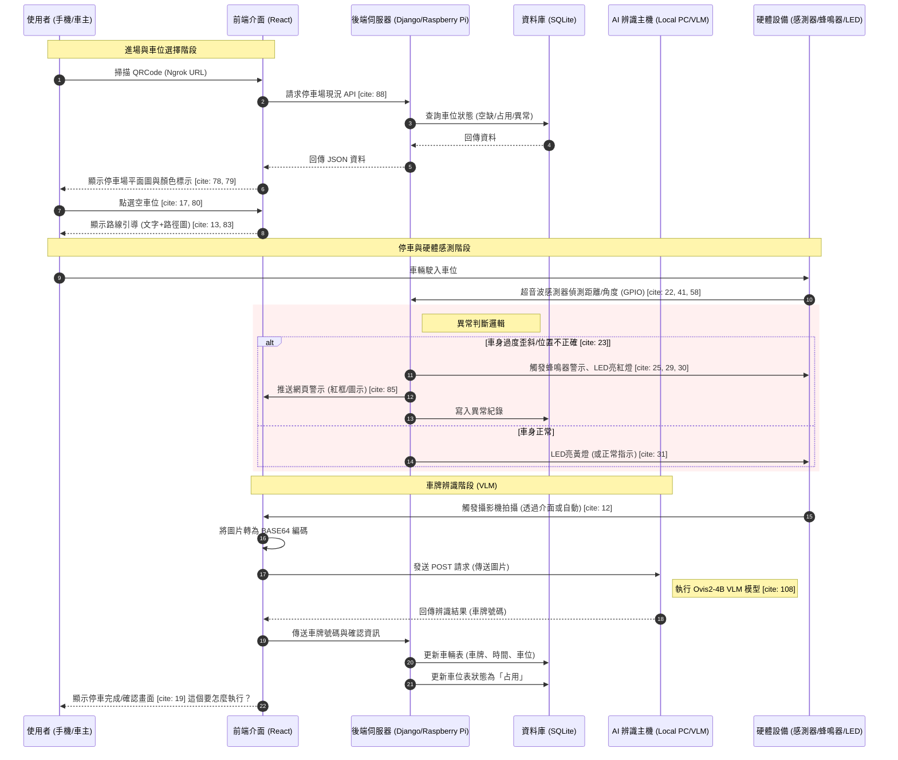
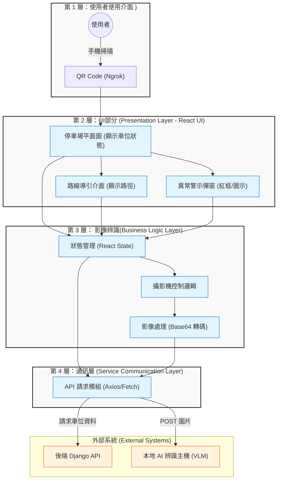

```mermaid

sequenceDiagram
    autonumber
    participant User as 使用者 (手機/車主)
    participant FE as 前端介面 (React)
    participant BE as 後端伺服器 (Django/Raspberry Pi)
    participant DB as 資料庫 (SQLite)
    participant AI as AI 辨識主機 (Local PC/VLM)
    participant HW as 硬體設備 (感測器/蜂鳴器/LED)

    Note over User, FE: 進場與車位選擇階段
    User->>FE: 掃描 QRCode (Ngrok URL) 
    FE->>BE: 請求停車場現況 API [cite: 88]
    BE->>DB: 查詢車位狀態 (空缺/占用/異常) 
    DB-->>BE: 回傳資料
    BE-->>FE: 回傳 JSON 資料
    FE-->>User: 顯示停車場平面圖與顏色標示 [cite: 78, 79]
    User->>FE: 點選空車位 [cite: 17, 80]
    FE-->>User: 顯示路線引導 (文字+路徑圖) [cite: 13, 83]

    Note over User, HW: 停車與硬體感測階段
    User->>HW: 車輛駛入車位
    HW->>BE: 超音波感測器偵測距離/角度 (GPIO) [cite: 22, 41, 58]
    
    rect rgb(255, 240, 240)
    Note right of BE: 異常判斷邏輯
    alt 車身過度歪斜/位置不正確 [cite: 23]
        BE->>HW: 觸發蜂鳴器警示、LED亮紅燈 [cite: 25, 29, 30]
        BE->>FE: 推送網頁警示 (紅框/圖示) [cite: 85]
        BE->>DB: 寫入異常紀錄 
    else 車身正常
        BE->>HW: LED亮黃燈 (或正常指示) [cite: 31]
    end
    end

    Note over FE, AI: 車牌辨識階段 (VLM)
    HW->>FE: 觸發攝影機拍攝 (透過介面或自動) [cite: 12]
    FE->>FE: 將圖片轉為 BASE64 編碼 
    FE->>AI: 發送 POST 請求 (傳送圖片) 
    Note right of AI: 執行 Ovis2-4B VLM 模型 [cite: 108]
    AI-->>FE: 回傳辨識結果 (車牌號碼)
    FE->>BE: 傳送車牌號碼與確認資訊
    BE->>DB: 更新車輛表 (車牌、時間、車位) 
    BE->>DB: 更新車位表狀態為「占用」 
    FE-->>User: 顯示停車完成/確認畫面 [cite: 19] 這個要怎麼執行？

```
---

```mermaid
graph TD
    %% 定義樣式
    classDef layer fill:#f9f9f9,stroke:#333,stroke-width:2px;
    classDef component fill:#e1f5fe,stroke:#0277bd,stroke-width:1px;
    classDef external fill:#fff3e0,stroke:#ef6c00,stroke-width:1px;

    subgraph User_Layer ["第 1 層：使用者使用介面 )"]
        direction TB
        U((使用者)) -->|手機掃描| QR["QR Code (Ngrok)"]
    end

    subgraph Presentation_Layer ["第 2 層：UI部分 (Presentation Layer - React UI)"]
        direction TB
        Page_Map["停車場平面圖 (顯示車位狀態)"]
        Page_Guide["路線導引介面 (顯示路徑)"]
        Alert_UI["異常警示彈窗 (紅框/圖示)"]
    end

    subgraph Logic_Layer ["第 3 層： 影像辨識(Business Logic Layer)"]
        direction TB
        State_Mgr["狀態管理 (React State)"]
        Img_Process["影像處理 (Base64 轉碼)"]
        Cam_Ctrl["攝影機控制邏輯"]
    end

    subgraph Service_Layer ["第 4 層：通訊層 (Service Communication Layer)"]
        direction TB
        API_Client["API 請求模組 (Axios/Fetch)"]
    end

    subgraph External_Systems ["外部系統 (External Systems)"]
        Backend_API["後端 Django API"]
        AI_Server["本地 AI 辨識主機 (VLM)"]
    end

    %% 層級關聯
    QR --> Page_Map
    Page_Map --> Page_Guide
    Page_Map --> Alert_UI

    Page_Map --> State_Mgr
    Page_Guide --> State_Mgr
    Alert_UI --> State_Mgr
    
    State_Mgr --> Cam_Ctrl
    Cam_Ctrl --> Img_Process
    
    State_Mgr --> API_Client
    Img_Process --> API_Client

    API_Client -->|"請求車位資料"| Backend_API
    API_Client -->|"POST 圖片"| AI_Server

    %% 套用樣式
    class User_Layer,Presentation_Layer,Logic_Layer,Service_Layer layer;
    class Page_Map,Page_Guide,Alert_UI,State_Mgr,Img_Process,Cam_Ctrl,API_Client component;
    class Backend_API,AI_Server external;
```

```mermaid
stateDiagram-v2
    direction LR

    %% 定義狀態
    state "Idle (空車位)" as Idle
    state "Reserved (預約/導引中)" as Reserved
    state "Parking_Attempt (停車偵測中)" as Parking
    state "Identifying (AI 車牌辨識)" as AI_Check
    state "Alignment_Check (車態檢查)" as Align
    state "Parked (已停妥/占用)" as Occupied
    
    %% 異常狀態
    state "Error_Skewed (異常：歪斜)" as Err_Skew
    state "Error_Mismatch (異常：車牌不符)" as Err_Plate

    %% 初始狀態
    [*] --> Idle

    %% 狀態流轉
    Idle --> Reserved : 使用者掃碼並選位
    
    Reserved --> Parking : 超音波感測器觸發 (GPIO)
    Idle --> Parking : 未預約直接駛入
    
    Parking --> AI_Check : 車輛靜止/觸發拍照
    
    AI_Check --> Align : 辨識成功 & 車牌吻合
    AI_Check --> Err_Plate : 車牌不吻合
    
    Align --> Err_Skew : 偵測過度歪斜
    Align --> Occupied : 位置正常

    %% 錯誤處理與恢復
    Err_Skew --> Align : 車主調整車輛
    Err_Skew --> Idle : 車主離開
    Err_Plate --> Idle : 車主離開

    %% 離場
    Occupied --> Idle : 車輛駛離 (感測器數值歸零)

    %% 狀態行為註解 (Actions)
    note right of Idle
        LED: 關閉/綠燈
        Web: 顯示空缺
    end note

    note right of Reserved
        Web: 顯示路線圖
    end note

    note right of Err_Skew
        HW: 蜂鳴器響 + 紅燈
        Web: 紅框警示
    end note

    note right of Occupied
        HW: 黃燈
        DB: 更新狀態為占用
    end note
```
