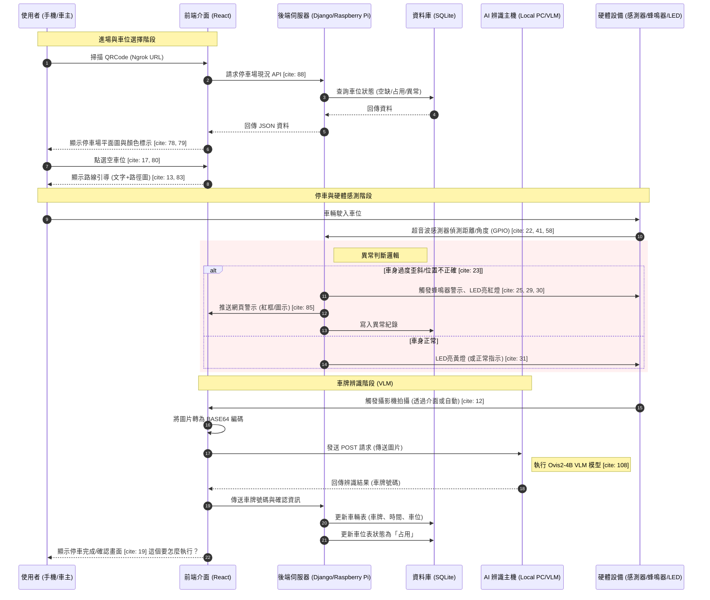

```mermaid

sequenceDiagram
    autonumber
    participant User as 使用者 (手機/車主)
    participant FE as 前端介面 (React)
    participant BE as 後端伺服器 (Django/Raspberry Pi)
    participant DB as 資料庫 (SQLite)
    participant AI as AI 辨識主機 (Local PC/VLM)
    participant HW as 硬體設備 (感測器/蜂鳴器/LED)

    Note over User, FE: 進場與車位選擇階段
    User->>FE: 掃描 QRCode (Ngrok URL) 
    FE->>BE: 請求停車場現況 API [cite: 88]
    BE->>DB: 查詢車位狀態 (空缺/占用/異常) 
    DB-->>BE: 回傳資料
    BE-->>FE: 回傳 JSON 資料
    FE-->>User: 顯示停車場平面圖與顏色標示 [cite: 78, 79]
    User->>FE: 點選空車位 [cite: 17, 80]
    FE-->>User: 顯示路線引導 (文字+路徑圖) [cite: 13, 83]

    Note over User, HW: 停車與硬體感測階段
    User->>HW: 車輛駛入車位
    HW->>BE: 超音波感測器偵測距離/角度 (GPIO) [cite: 22, 41, 58]
    
    rect rgb(255, 240, 240)
    Note right of BE: 異常判斷邏輯
    alt 車身過度歪斜/位置不正確 [cite: 23]
        BE->>HW: 觸發蜂鳴器警示、LED亮紅燈 [cite: 25, 29, 30]
        BE->>FE: 推送網頁警示 (紅框/圖示) [cite: 85]
        BE->>DB: 寫入異常紀錄 
    else 車身正常
        BE->>HW: LED亮黃燈 (或正常指示) [cite: 31]
    end
    end

    Note over FE, AI: 車牌辨識階段 (VLM)
    HW->>FE: 觸發攝影機拍攝 (透過介面或自動) [cite: 12]
    FE->>FE: 將圖片轉為 BASE64 編碼 
    FE->>AI: 發送 POST 請求 (傳送圖片) 
    Note right of AI: 執行 Ovis2-4B VLM 模型 [cite: 108]
    AI-->>FE: 回傳辨識結果 (車牌號碼)
    FE->>BE: 傳送車牌號碼與確認資訊
    BE->>DB: 更新車輛表 (車牌、時間、車位) 
    BE->>DB: 更新車位表狀態為「占用」 
    FE-->>User: 顯示停車完成/確認畫面 [cite: 19] 這個要怎麼執行？

```
