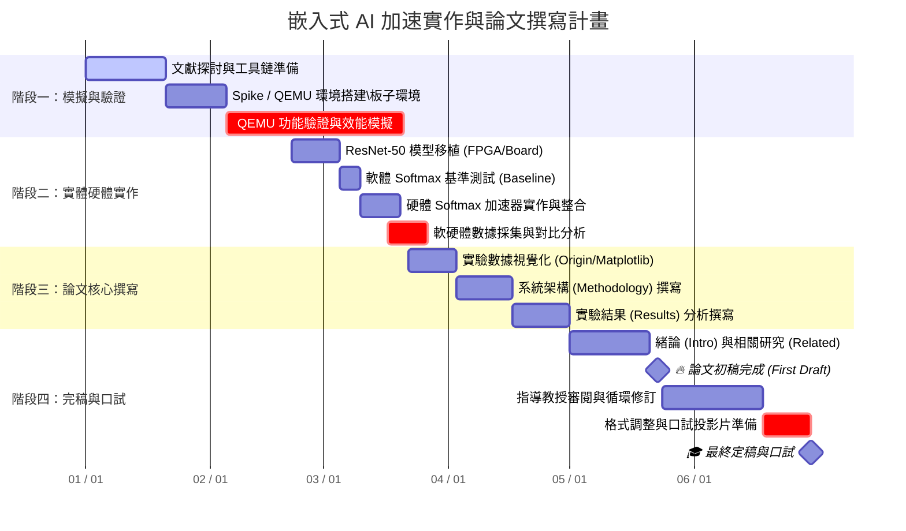

# 實驗設計

# 時程表

```mermaid
gantt
    title 嵌入式 AI 加速實作與論文撰寫計畫
    dateFormat  YYYY-MM-DD
    axisFormat  %m / %d
    
    %% 顏色定義
    section 階段一：模擬與驗證
    文獻探討與工具鏈準備           :active, a1, 2026-01-01, 20d
    Spike / QEMU 環境搭建\板子環境         :a2, 2026-01-21, 15d
    QEMU 功能驗證與效能模擬        :crit, a3, 2026-02-05, 44d

    section 階段二：實體硬體實作
    ResNet-50 模型移植 (FPGA/Board) :b1, 2026-02-21, 12d
    軟體 Softmax 基準測試 (Baseline) :b2, 2026-03-05, 5d
    硬體 Softmax 加速器實作與整合    :b3, 2026-03-10, 10d
    軟硬體數據採集與對比分析        :crit, b4, 2026-03-17, 10d

    section 階段三：論文核心撰寫
    實驗數據視覺化 (Origin/Matplotlib) :c1, 2026-03-22, 12d
    系統架構 (Methodology) 撰寫      :c2, 2026-04-03, 14d
    實驗結果 (Results) 分析撰寫      :c3, 2026-04-17, 14d

    section 階段四：完稿與口試
    緒論 (Intro) 與相關研究 (Related)  :d1, 2026-05-01, 20d
    🔥 論文初稿完成 (First Draft)    :milestone, 2026-05-23, 0d
    指導教授審閱與循環修訂           :d2, 2026-05-24, 25d
    格式調整與口試投影片準備         :crit, d3, 2026-06-18, 12d
    🎓 最終定稿與口試               :milestone, 2026-06-30, 0d


```

- ### 說明: 1/21 ~ 2/21(spike/qemu模擬) 2/21 ~ 3/21 (實體板子實作(softmax應用resnet50)) 3/22 ~ 4/30(論文數據與架構整理) 5/1 ~ 6/30(論文完稿和校正)
