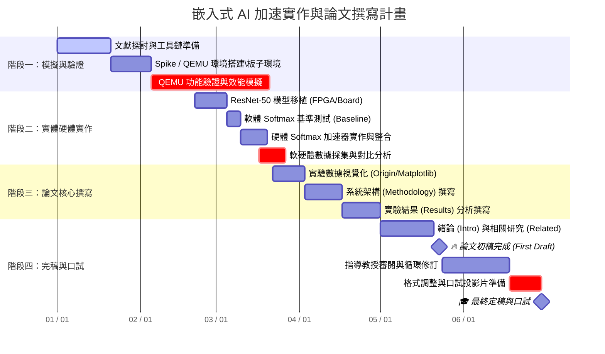

# 實驗設計

# 研究設計：實驗規劃

## 實驗總覽

本研究依「指令層 → 模組層 → 系統層」之三層次驗證策略，共設計四組實驗，由淺入深逐層驗證所提方法之有效性。

| 層級 | 實驗編號 | 實驗名稱 | 對照組 | 對應貢獻 |
|------|---------|---------|--------|---------|
| 指令層 | 實驗一 | CORDIC exp 自訂指令 vs `math.h` `exp()` | C 標準函式庫 `exp()` | 貢獻一：SIMD CORDIC exp 自訂指令 |
| 指令層 | 實驗二 | 牛頓法倒數自訂指令 vs 軟體除法 | C 軟體浮點除法 | 貢獻二：牛頓法倒數自訂指令 |
| 模組層 | 實驗三 | 加速版 Softmax vs 原始軟體 Softmax | 純軟體 Softmax 實作 | 貢獻三：整合兩條自訂指令之 Softmax 加速架構 |
| 系統層 | 實驗四 | ResNet-50 整體推論 vs 其他文獻 | 其他 GPU/ASIC/FPGA 方案 | 貢獻四：完整系統之 PPA 與效能優勢 |

---

## 實驗一：CORDIC exp 自訂指令 vs `math.h` exp

### 實驗目的
驗證所新增之 CORDIC exp 自訂指令於單一 exp 運算上之 **執行速度** 與 **數值精度**，相較於 C 標準函式庫 `math.h` 中之 `exp()` 函式之效益。

### 對照組設計
- **受測組（DUT）**：Mi-V 軟核上新增之 CORDIC exp 自訂指令
- **對照組（Baseline）**：C 標準函式庫 `math.h` 之 `exp()` 函式
- **驗證項目**：自訂指令是否在可接受之精度範圍內，提供顯著之執行時間加速

### 實驗設計六要素

| 要素 | 內容 |
|------|------|
| 情境 | Softmax 層中之 exp 單一運算驗證 |
| 環境 | PolarFire SoC Icicle Kit 開發板 |
| 軟硬體 | Mi-V 軟核（部署於 FPGA Fabric）、SoftConsole IDE、RISC-V GCC `-O2` |
| 參數 | CORDIC 流水線級數：10 級；時脈頻率：待補 MHz |
| Data Set | 100 組浮點數輸入，範圍 [-10, 10]，涵蓋 Softmax 經 max-subtraction 後之典型分佈 |
| 資料格式 | 對照組：IEEE 754 浮點；受測組：輸入先軟體轉換為 Q8.24 定點後送入自訂指令 |

### 量測指標
1. **執行時間**：以處理器內建週期計數器（Cycle Counter）量測單次運算之時脈週期數
2. **數值誤差**（以 IEEE 754 雙精度 `exp(x)` 為真值）：
   - 絕對誤差（Absolute Error）
   - 相對誤差（Relative Error）
  

### 預期圖表
- **圖 1-1**：100 組輸入下兩者執行週期數比較長條圖
- **圖 1-2**：誤差分佈散佈圖（X 軸：輸入值；Y 軸：相對誤差）
- **表 1-1**：執行時間與誤差統計總表

---

## 實驗二：牛頓法倒數自訂指令 vs 軟體除法

### 實驗目的
驗證所新增之牛頓法倒數自訂指令於單一倒數運算上之 **執行速度** 與 **數值精度**，相較於 C 軟體浮點除法之效益。實驗方式與實驗一相同。

### 對照組設計
- **受測組（DUT）**：Mi-V 軟核上新增之牛頓法倒數自訂指令（計算 1/x）
- **對照組（Baseline）**：C 軟體浮點除法（`1.0f / x`）
- **驗證項目**：自訂指令是否在可接受之精度範圍內，提供顯著之執行時間加速

### 實驗設計六要素

| 要素 | 內容 |
|------|------|
| 情境 | Softmax 層中之分母總和倒數運算 `1/Σexp(zⱼ)` 驗證 |
| 環境 | PolarFire SoC Icicle Kit 開發板（與實驗一相同） |
| 軟硬體 | Mi-V 軟核、SoftConsole IDE、RISC-V GCC `-O2`（與實驗一相同） |
| 參數 | 牛頓法迭代次數：待補；時脈頻率：與實驗一相同 |
| Data Set | 100 組浮點數輸入,範圍涵蓋 Softmax 分母總和之典型分佈（皆為正值） |
| 資料格式 | 對照組：IEEE 754 浮點；受測組：輸入先軟體轉換為 Q8.24 定點後送入自訂指令 |

### 量測指標
1. **執行時間**：以週期計數器量測單次運算之時脈週期數
2. **數值誤差**（以 IEEE 754 雙精度 `1/x` 為真值）：
   - 絕對誤差、相對誤差
3. **牛頓法迭代收斂次數**

### 預期圖表
- **圖 2-1**：100 組輸入下兩者執行週期數比較長條圖
- **圖 2-2**：誤差分佈散佈圖
- **圖 2-3**：牛頓法收斂曲線（迭代次數 vs 誤差）
- **表 2-1**：執行時間與誤差統計總表

---

## 實驗三：加速版 Softmax vs 原始軟體 Softmax

### 實驗目的
驗證整合 CORDIC exp 與牛頓法倒數兩條自訂指令後，**完整 Softmax 層** 相較於純軟體實作之 Softmax 之執行速度與精度。

### 對照組設計
- **受測組（DUT）**：以 CORDIC exp 自訂指令 + 牛頓法倒數自訂指令所實作之加速版 Softmax
- **對照組（Baseline）**：純軟體 Softmax（`math.h` 之 `exp()` + 軟體除法）
- **驗證項目**：兩條自訂指令整合後之綜合效益,含跨指令資料搬移之 overhead

### 實驗設計六要素

| 要素 | 內容 |
|------|------|
| 情境 | Softmax 層之完整運算流程驗證（含 max-subtraction、exp、Σ、倒數、乘法） |
| 環境 | PolarFire SoC Icicle Kit 開發板 |
| 軟硬體 | Mi-V 軟核、SoftConsole IDE、RISC-V GCC `-O2` |
| 參數 | Softmax 類別數：8 類（預計）；測試組數：20 組 |
| Data Set | **20 組分類向量**，每組 **8 個類別之 logits 輸入** |
| 資料格式 | 對照組：IEEE 754 浮點；受測組：浮點輸入，內部轉換為 Q8.24 |

### 量測指標
1. **執行時間**：單組 Softmax 之時脈週期數
2. **輸出機率向量誤差**：
   - 每組 8 個類別輸出之絕對誤差、相對誤差
3. **加速比**：受測組相對對照組之加速倍數
4. **分類結果一致性**：argmax 結果是否與對照組相同

---

## 實驗四：ResNet-50 整體推論 vs 其他文獻

### 實驗目的
驗證搭載本研究加速架構之完整 ResNet-50 推論系統，相較於其他文獻（GPU、ASIC、FPGA 方案）之 **PPA（Power, Performance, Area）** 與 **執行時間** 之優勢。

### 對照組設計
- **受測組（DUT）**：Icicle Kit + Mi-V SIMD 加速架構之 ResNet-50 推論系統
- **對照組**：
  - 對照 A：GPU 平台（例如 NVIDIA Jetson Nano 等邊緣 GPU）
  - 對照 B：既有 Softmax/ResNet-50 ASIC 加速器（引用文獻數據）
  - 對照 C：既有 FPGA 加速器（引用文獻數據）
- **驗證項目**：本研究於邊緣推論場景下之綜合競爭力

### 實驗設計六要素

| 要素 | 內容 |
|------|------|
| 情境 | 邊緣端 ResNet-50 影像分類推論之完整系統評估 |
| 環境 | PolarFire SoC Icicle Kit + Mi-V 加速架構（受測組）；對照組依各文獻平台 |
| 軟硬體 | Icicle Kit 全系統；ResNet-50 預訓練模型 |
| 參數 | ResNet-50 標準架構；推論批次大小：待定 |
| Data Set | **200 組（預計）影像輸入**，來源：ImageNet 驗證集隨機抽樣 |
| 資料格式 | 影像輸入：標準預處理；推論輸出：1000 類別之 Top-1 / Top-5 分類結果 |

### 量測指標

#### Performance（效能）
- 單張影像推論延遲（ms）
- 整體吞吐量（images/sec）
- Top-1 / Top-5 分類準確率（%）

#### Power（功耗）
- 整體系統功耗（W 或 mW）
- 每張影像之能量消耗（mJ/image）
- Energy-Delay Product（EDP）

#### Area（面積／資源）
- FPGA 資源使用量：LUT、FF、DSP、BRAM 數量
- 與對照組之資源量比例（normalized resource）

#### 其他綜合指標
- TOPS / W（每瓦特運算量）
- Performance per mm²（單位面積效能,與 ASIC 對照組比較）

---

## 八股檢核(待確定）

| 檢核項目 | 完成情況 |
|----------|---------|
| 每個實驗有對照組 | 四組實驗皆明確定義對照組 |
| 實驗六要素齊全（情境、環境、軟硬體、參數、Data Set、資料格式） | 四組實驗皆以表格列出 |
| 每個實驗對應 Introduction 之貢獻 |  四組實驗分別對應四項貢獻 |
| 每個圖表對應問題與貢獻 | 預期圖表已標註對應驗證目的 |
| 與 Intro 文獻定性 + 定量比較 | ⏳ 實驗四將與文獻定量比較，待文獻回顧確認對照對象 |
| 區分 Experiment / Simulation / Emulation | 全部為實機 Experiment（Icicle Kit 上實測） |

---

## 待補項目

1. Mi-V 軟核實際時脈頻率
2. CORDIC 10 級流水線之具體配置（位元寬度、迭代次數）
3. 牛頓法倒數之初始猜測值產生方式與迭代次數
4. 實驗四對照組之具體文獻清單（建議 3 篇近年 Softmax/ResNet-50 FPGA/ASIC 加速論文）
5. SIMD 並行度 N 之實際決定值
6. 各實驗之實際數據（待實驗執行後填入）

# 時程表

- ### 說明: 1/21 ~ 2/21(spike/qemu模擬) 2/21 ~ 3/21 (實體板子實作(softmax應用resnet50)) 3/22 ~ 4/30(論文數據與架構整理) 5/1 ~ 6/30(論文完稿和校正)
